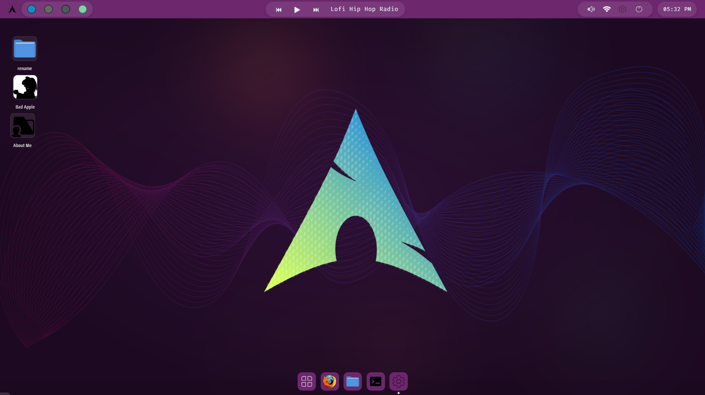
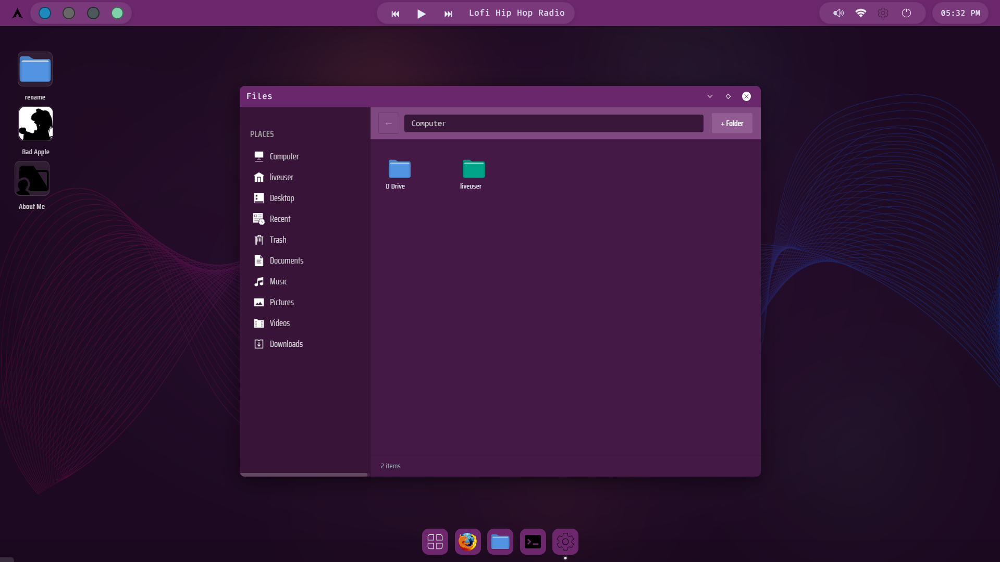
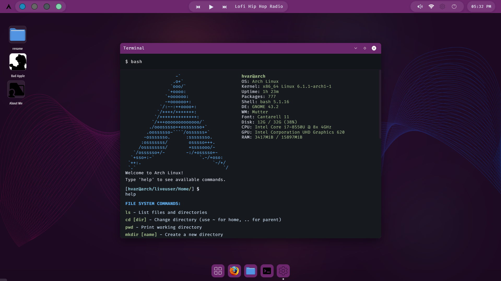
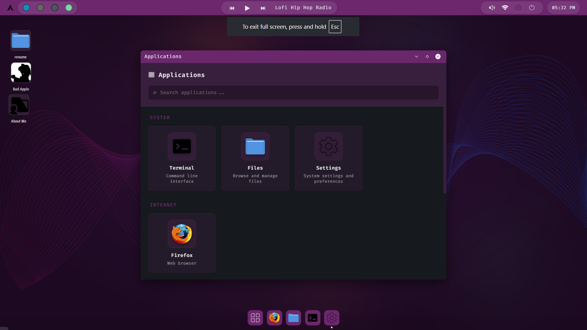
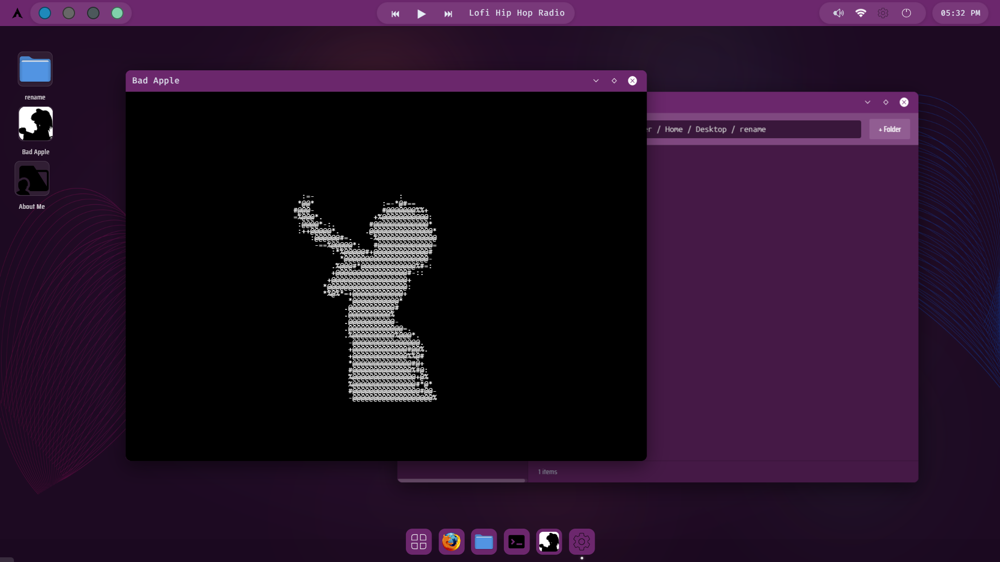
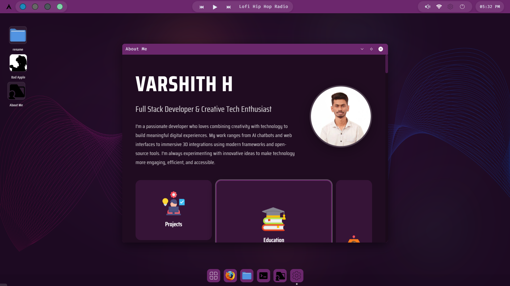
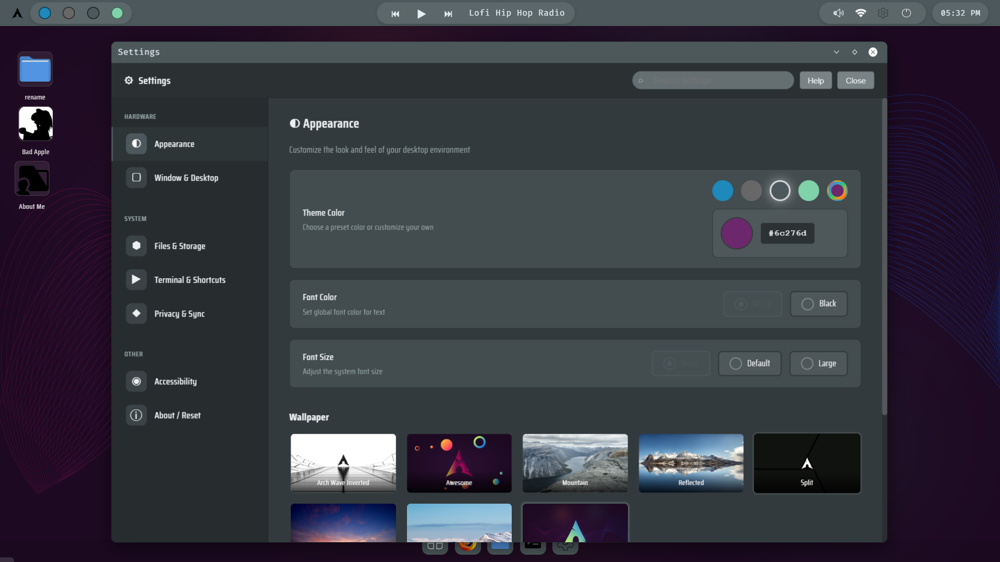
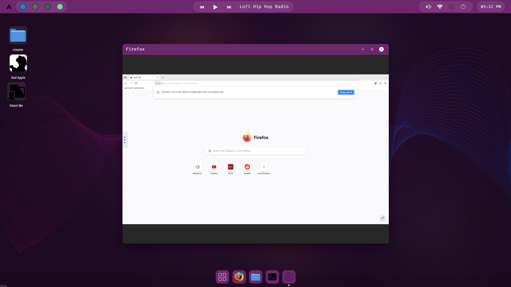

# 🐧 Linux Web OS - Interactive Desktop Environment

<div align="center">



**A fully functional Linux-inspired desktop environment running entirely in your browser**

[](https://svelte.dev/)
[](https://vitejs.dev/)
[](https://nodejs.org/)

</div>

---

## 📖 Table of Contents

- [✨ Features](#-features)
- [🎬 Screenshots](#-screenshots)
- [🚀 Quick Start](#-quick-start)
- [🏗️ Architecture](#️-architecture)
- [🎮 Usage](#-usage)
- [⚙️ Configuration](#️-configuration)
- [🎨 Theming](#-theming)
- [⌨️ Keyboard Shortcuts](#️-keyboard-shortcuts)
- [🤝 Contributing](#-contributing)
- [📄 License](#-license)

---

## ✨ Features

### 🖥️ **Complete Desktop Experience**
- **Window Management**: Draggable, resizable, minimizable windows with z-index stacking
- **Multi-tasking**: Run multiple applications simultaneously
- **Context Menus**: Right-click menus for desktop and file operations
- **Drag & Drop**: Rearrange desktop items with persistent positioning
- **Custom Cursors**: Linux-themed cursor set throughout the interface

### 📁 **File Manager**
- **Virtual Filesystem**: Complete filesystem emulation with folders and files
- **Navigation**: Browse, create, rename, delete files and folders
- **Grid View**: Clean, organized file display
- **Context Actions**: Right-click for file operations
- **Persistent Storage**: All changes saved to backend

### 💻 **Terminal Emulator**
- **30+ Commands**: Full-featured command-line interface
- **File Operations**: `ls`, `cd`, `mkdir`, `rm`, `touch`, `cat`, `mv`, `cp`
- **Application Launchers**: Open apps directly from terminal
- **Command History**: Navigate history with ↑/↓ arrow keys
- **Auto-complete**: Tab completion for commands (planned)

### 🎵 **Media Player**
- **Streaming Radio**: Built-in music player with 4 radio stations
- **Volume Control**: Global volume slider with Web Audio API
- **Bad Apple Animation**: ASCII art animation player with audio sync
- **Playback Controls**: Play/pause, mute, seek controls

### ⚙️ **System Settings**
- **Appearance**: Dark/light themes with 4 color schemes
- **Wallpapers**: 8 pre-loaded Arch Linux inspired wallpapers
- **Custom Colors**: Create and save custom theme colors
- **Keyboard Shortcuts**: View and customize shortcuts
- **Accessibility**: High contrast and reduced motion options

### 🎯 **Applications**
- **About Me**: Personal portfolio with projects, education, skills, and contact info
- **Firefox Browser**: Web browser integration (local launcher)
- **Applications Menu**: Searchable app launcher with categories
- **Settings Panel**: Complete system configuration

### 🎨 **Customization**
- **4 Color Themes**: Blue, Gray, Teal, Green + Custom
- **8 Wallpapers**: High-quality backgrounds
- **Custom Fonts**: Fira Code, JetBrains Mono, Nunito
- **Responsive Design**: Works on desktop and tablet screens

---

## 🎬 Screenshots

<details open>
<summary><b>Desktop & Applications</b></summary>

### Home Screen

*Clean desktop with draggable icons and customizable wallpaper*

### File Manager

*Browse and manage files with an intuitive interface*

### Terminal

*Full-featured terminal with 30+ commands*

### Applications Menu

*Searchable app launcher with categories*

</details>

<details>
<summary><b>Media & Entertainment</b></summary>

### Media Player

*Built-in music player with radio stations and Bad Apple animation*

### Portfolio

*Personal portfolio with smooth scrolling sections*

</details>

<details>
<summary><b>System & Customization</b></summary>

### Settings & Themes

*Customize appearance, wallpapers, and system preferences*

### Firefox Integration

*Launch Firefox browser directly from the desktop*

</details>

---

## 🚀 Quick Start

### Prerequisites

- **Node.js** (v16 or higher)
- **npm** or **yarn**
- Modern web browser (Chrome, Firefox, Edge)

### Installation

1. **Clone the repository**
```bash
git clone https://github.com/yourusername/linux-web-os.git
cd linux-web-os
```

2. **Install dependencies**
```bash
npm install
```

3. **Start the backend server**
```bash
cd server
npm install
node server.js
```
The server will run on `http://localhost:3001`

4. **Start the frontend development server**
```bash
# In the root directory
npm run dev
```
The app will open at `http://localhost:5173`

### Building for Production

```bash
npm run build
npm run preview
```

---

## 🏗️ Architecture

### Technology Stack

| Layer | Technology |
|-------|-----------|
| **Frontend** | Svelte 4 + Vite |
| **Backend** | Express.js + Node.js |
| **Storage** | LocalStorage + JSON File |
| **Styling** | CSS3 with CSS Variables |
| **Fonts** | Fira Code, Nunito, Saira Condensed |

### Component Structure

```
src/
├── components/
│   ├── Desktop.svelte          # Main desktop container
│   ├── Window.svelte           # Window wrapper component
│   ├── Terminal.svelte         # Terminal emulator
│   ├── FileManager.svelte      # File browser
│   ├── Applications.svelte     # App launcher
│   ├── AboutMe.svelte          # Portfolio page
│   ├── BadApple.svelte         # ASCII animation player
│   ├── Settings.svelte         # Settings panel
│   ├── WallpaperPicker.svelte  # Wallpaper selector
│   ├── Panel.svelte            # Status bar
│   └── rightclick/
│       ├── DesktopRightClick.svelte
│       └── FolderRightClick.svelte
├── lib/
│   ├── commands.js             # Terminal commands
│   ├── settingsStore.js        # Settings state
│   └── storage.js              # LocalStorage utilities
├── styles/
│   ├── global.css              # Theme variables
│   ├── desktop.css             # Desktop styles
│   ├── terminal.css            # Terminal styles
│   └── ...                     # Component-specific styles
└── routes/
    └── +page.svelte            # Main entry point
```

### Server Structure

```
server/
├── server.js                   # Express API server
├── filesystem.json             # Virtual filesystem data
└── package.json
```

---

## 🎮 Usage

### Desktop Interactions

- **Right-click Desktop**: Open context menu
- **Double-click Item**: Open folder/file
- **Drag & Drop**: Rearrange desktop icons
- **Click Outside**: Close menus and dialogs

### Window Management

- **Drag Title Bar**: Move window
- **Click Anywhere**: Bring window to front
- **Minimize Button**: Hide window to dock
- **Maximize Button**: Fullscreen window
- **Close Button**: Close application

### Terminal Commands

#### File System
```bash
ls                    # List files and directories
cd <directory>        # Change directory
pwd                   # Print working directory
mkdir <name>          # Create directory
touch <name>          # Create file
rm <name>             # Delete file/folder
cat <file>            # Display file contents
mv <from> <to>        # Move/rename file
cp <from> <to>        # Copy file
```

#### Applications
```bash
terminal              # Open terminal
filemanager           # Open file manager
settings              # Open settings
apps                  # Open applications menu
aboutme               # Open portfolio
badapple              # Open Bad Apple animation
wallpaper             # Open wallpaper picker
```

#### System
```bash
help                  # Show all commands
clear                 # Clear terminal
history               # Show command history
date                  # Show current date/time
whoami                # Display current user
screenfetch           # Display system info
```

---

## ⚙️ Configuration

### Environment Variables

Create a `.env` file in the root directory:

```env
VITE_API_URL=http://localhost:3001
```

### Server Configuration

Edit `server/server.js`:

```javascript
const PORT = 3001  // Change server port
```

### Customizing Filesystem

Edit `server/filesystem.json` to customize the initial file structure:

```json
{
  "id": 0,
  "name": "Computer",
  "type": "folder",
  "children": [...]
}
```

---

## 🎨 Theming

### Built-in Themes

1. **Blue** - Default Arch Linux inspired theme
2. **Gray** - Professional monochrome
3. **Teal** - Modern cool tones
4. **Green** - Classic Linux green

### Custom Theme Colors

Open Settings → Appearance → Custom Color to create your own theme.

### CSS Variables

Customize in `src/styles/global.css`:

```css
:root {
  --bg: #0b0f15;
  --surface: #0f1720;
  --text: #e6eef6;
  --accent: #63b3ff;
  --cursor-default: url('/references/cursors/default_24.svg');
}
```

---

## ⌨️ Keyboard Shortcuts

| Shortcut | Action |
|----------|--------|
| `Ctrl+Alt+T` | Open Terminal |
| `Ctrl+Alt+F` | Open File Manager |
| `Ctrl+Alt+A` | Open Applications |
| `Ctrl+Alt+S` | Open Settings |
| `Ctrl+Alt+W` | Open Wallpaper Picker |
| `Super/Win` | Open Applications |
| `Ctrl+L` | Clear Terminal |
| `↑/↓` | Navigate command history |
| `Esc` | Close menus/dialogs |

*Shortcuts can be customized in Settings → Terminal & Shortcuts*

---

## 🛠️ Development

### Project Structure

```
LINUX_WEB/
├── src/                    # Frontend source code
├── server/                 # Backend API server
├── public/                 # Static assets
│   ├── bad-apple-frames.json
│   └── references/         # Icons, wallpapers, cursors
├── outputimages/           # Screenshots
├── z-checkpoints/          # Documentation
├── package.json
├── vite.config.js
└── README.md
```

### Running Tests

```bash
# Run linter
npm run lint

# Format code
npm run format
```

### Adding New Applications

1. Create component in `src/components/YourApp.svelte`
2. Add to `Desktop.svelte` windows object
3. Add icon to `public/references/icons/`
4. Register in `Applications.svelte`

---

## 📊 Performance

- **Initial Load**: < 1 second
- **Memory Usage**: ~50MB
- **Desktop Refresh**: Every 3 seconds
- **Animation FPS**: 60 FPS smooth
- **Bad Apple FPS**: 30 FPS ASCII animation

---

## 🐛 Known Issues

- A11y warnings (non-blocking)
- Firefox launcher requires local helper script
- Window resizing from corners only

---

## 🗺️ Roadmap

### v1.1 (Planned)
- [ ] File drag between windows
- [ ] Multi-file selection
- [ ] Keyboard navigation
- [ ] Context menu improvements

### v1.2 (Future)
- [ ] Text editor application
- [ ] Image viewer
- [ ] System monitor
- [ ] Virtual desktop spaces

### v2.0 (Vision)
- [ ] Multi-user support
- [ ] Cloud storage integration
- [ ] Mobile responsive design
- [ ] PWA support

---

## 🤝 Contributing

Contributions are welcome! Please follow these steps:

1. Fork the repository
2. Create a feature branch (`git checkout -b feature/amazing-feature`)
3. Commit your changes (`git commit -m 'Add amazing feature'`)
4. Push to the branch (`git push origin feature/amazing-feature`)
5. Open a Pull Request

### Code Style

- Use 2 spaces for indentation
- Follow Svelte best practices
- Add comments for complex logic
- Test thoroughly before submitting

---

## 📄 License

This project is licensed under the MIT License - see the [LICENSE](LICENSE) file for details.

---

## 👨‍💻 Author

**Varshith H**

- Portfolio: [About Me Section](http://localhost:5173)
- GitHub: [@varshit3463](https://github.com/varshit3463)
- LinkedIn: [Varshith H](https://linkedin.com/in/varshith-h-0302bb2b7)
- Email: hvarshith5@gmail.com

---

## 🙏 Acknowledgments

- **Arch Linux** - Inspiration for the design
- **Svelte Team** - Amazing framework
- **Open Source Community** - Icons and resources

---

## 📝 Changelog

### v1.0.0 (November 2025)
- ✨ Initial release
- 🖥️ Complete desktop environment
- 📁 File manager with CRUD operations
- 💻 Terminal with 30+ commands
- 🎨 4 themes + custom colors
- 🎵 Media player with radio & Bad Apple
- ⚙️ Settings panel
- 📱 Portfolio integration
- ⌨️ Keyboard shortcuts

---

<div align="center">

**⭐ If you like this project, please give it a star on GitHub! ⭐**

Made with ❤️ and ☕

</div>
